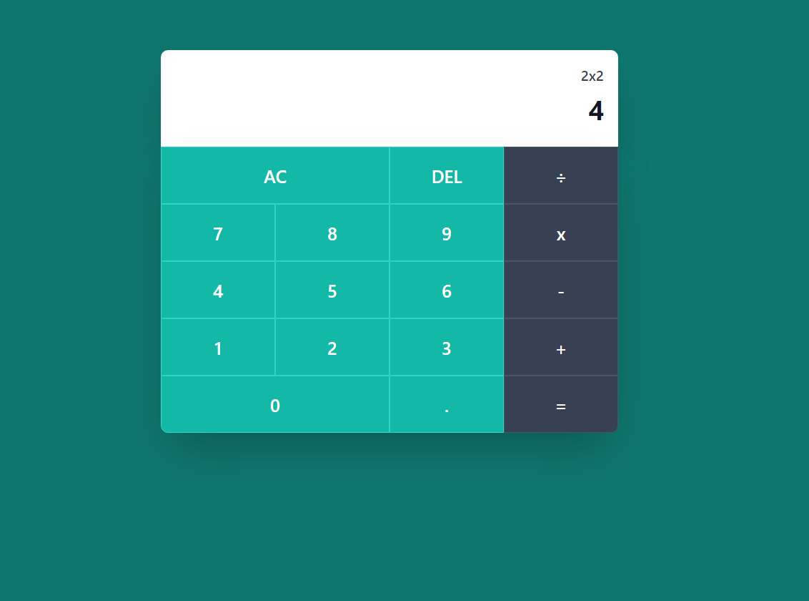

# Calculadora com tailwind

Calculadora feita com objetivo de obter conhecimento nos fundamentos do vue e praticar tailwind.



## Tecnologias utilizadas
- Vue.js 3
- Tailwind
- HTML
- JavaScript
- Vite

## Execução do projeto

### Baixando as dependências

```sh
npm install
```

### Executando no servidor

```sh
npm run dev
```

